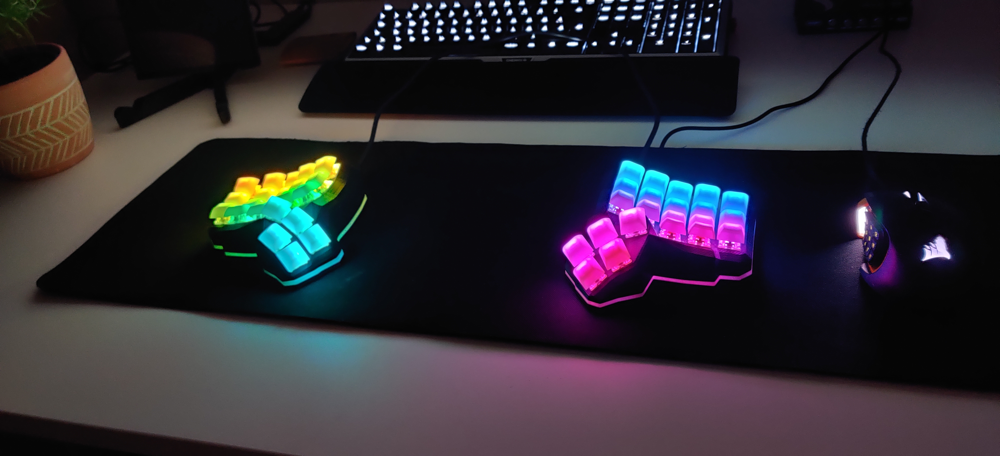
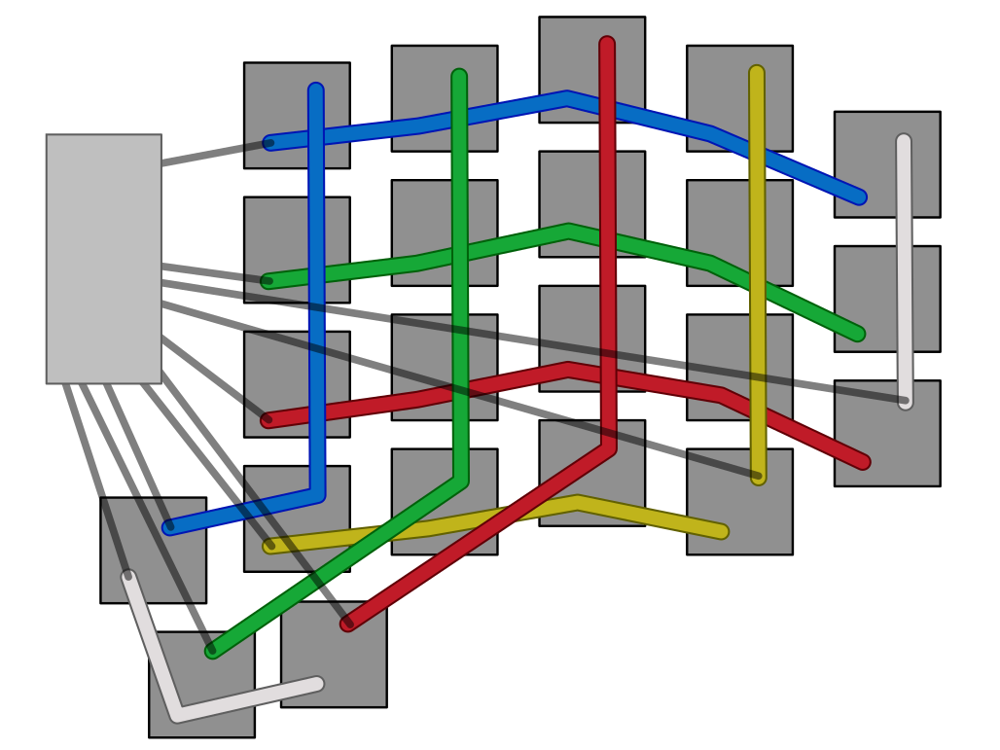
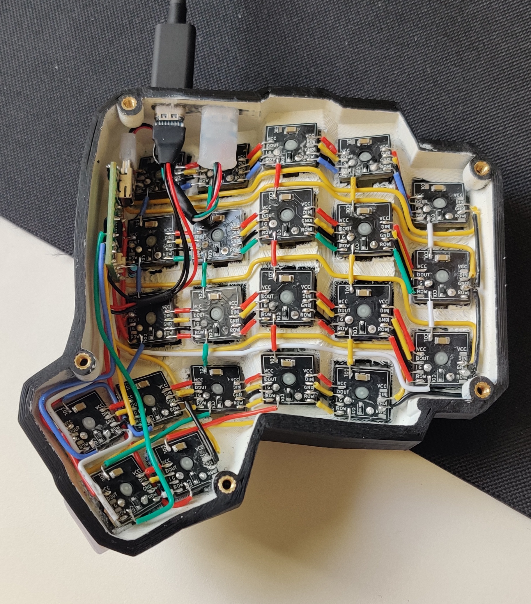

# Description
The Iamb Manuform is a Dactyl Manuform 4x5, based on the [Dactyl Manuform mini](https://github.com/l4u/dactyl-manuform-mini-keyboard), running on two Teensy 2.0s. It has two USB Type-C ports for connectivity and per-key RGB.



# 3D Printing
To generate the SCAD files for the casing, the transparent stripes and the bottom plate, you simply need to run `lein generate` in the casing directory. You can then load them up in OpenSCAD to inspect and convert them to `.stl` files. If you need to adjust the models, you can modify the `iamb.clj` script to your liking.

*Note*: If you want to build the keyboard exactly as you see in the pictures, you can also use the existing `.stl` files.

For actually printing the casings I used some black ABS filament, printed on my Ender 3 v2. The prints turned out okay but next time I would like to do some more post-processing on the outside, as the layer lines are quite visible. The transparent stripe was printed with transparent PLA (on the same printer) and honestly turned out very well.

After the case was printed, I primed the inside and spray painted it white. I did so to make as much light as possible reflect from the walls. I also added a layer of white foil to the top of the bottom plate. Both of these modifications had a *huge* impact on the brightness of the stripe, so much so that I didn't even need to add an extra RGB strip. This step is definitely optional but I would highly recommend it.

The last step is to add some threaded inserts to the dedicated holes. I used some M3 brass inserts and M3x12 screws to attach the bottom plate. The screws needed to be a bit longer than for my other builds because of the transparent stripe but I think you could probably get away with 8mm as well.

# Bottom plate
The bottom plate is laser-cut from 4mm stainless steel sheets. The added weight gives the keyboard a more premium feel and helps with friction so you don't push it around while typing. In order to get parts cut, you need to convert `plate.scad` to a `.dxf` file. This too can be done with OpenSCAD.

*Note*: If you want to build the keyboard exactly as you see in the pictures, you can also use the existing `.dxf` file.

After that you can just upload the file at a website for laser-cut parts and place your order (left and right don't matter for this step, so just order a multiple of two). I ordered mine from a German website and they arrived about a month later, looking very spiffy. I used a countersink bit so that the screws don't extend too far out the bottom and that's it! You could probably do some more cleaning up on the plates (I personally would love to try a sand blasted finish) but mine looked great already so I didn't bother.

# Switches
When the casings are done, the switches can just be pushed into place. I know some people fixate theirs with hot glue but I didn't really like the thought of that and I think the hold reasonably well as is. The switches I opted for are hand-lubed Cherry MX Reds and on top of them, some DSA profile foggy keycaps. The lube I used for this was Krytox GPL-205G0. I really like the smooth feel of these lubed linear switches and they give off a very pleasant sound as well.

On that note though, since I had to leave the inside mostly empty for light to bounce, there is a lot of empty space that is making the keyboard sound a bit more hollow than I would like. This is not a huge problem since it still sounds very nice, but it's definitely something I would like to improve upon in future versions.

# PCBs
The design of the PCBs I got from [this repository](https://github.com/PitBarber/PCB_for_HandwiredKeyboards) and then ordered them from [JLCPCB](https://jlcpcb.com/). I am very happy with the results but I must admit that soldering all the components to the PCBs was a real pain in the ass and I would not recommend it to anyone. You are probably better off just buying some off-the-shelf PCBs instead.

If you do go down that road though, the PCBs have a diode at the bottom which connects the rows to the columns. In order to make the wiring less painful, I made two badges: one for the left half, where the diodes are facing up, and one for the right half, where the diodes are facing down. This is also optional but I think it looks a lot cleaner like this. As a result of that, we need to tell QMK that one half is wired `COL2ROW` and the other is wired `ROW2COL`. You can see that switch happening in `config.h`. Just make sure to change this code should you not go for this split approach.

# Wiring
The wiring is pretty straight forward and I think almost self explanatory when looking at the `config.h` and the wiring diagram below.



Most wiring mistakes can be fixed very easily through software, since each half has its own pin layout. The `SPLIT_HAND_PIN` only needs to be pulled low on the left side and can be left floating on the right side. For the outer USB port, I used a mini-USB to USB Type-C cable that I shortened and uninsulated. The inner connector is just a USB-C breakout board with the D+ and D- pins bridged to form a 3-pin connector. It is important that this data pin (the `SOFT_SERIAL_PIN`) needs to be connected to either `D0`, `D1` or `D2` in order to work.

Here you can see a picture of the inside after everything is wired up:



I found that the best way to make a strong connection between the USB ports and the casing is to rough up the metal parts with some sandpaper and then just super glue them in place.

# Firmware
The keyboard is running [QMK](https://github.com/qmk/qmk_firmware). To compile and flash the firmware, you will need to install it. Luckily, it comes pre-packaged on most operating systems. After installing, you will need to run `qmk setup`.
Make sure there are no errors during the setup and install any missing packages (warnings can mostly be ignored).

Once QMK is set up, run this command to link the firmware folder so that QMK will be able to find it.
```
ln -s <full path to this repository>/firmware <path to qmk_firmware>/keyboards/handwired/iamb_manuform
```
*Note*: you can also copy the directory instead of linking it, but I like this approach as it eliminates the need to synchronize your files between QMK and the repository.

Afterwards you can compile the firmware by running
```
qmk compile -kb handwired/iamb_manuform -km default
```
Before flashing, you need to make sure that you are compiling the firmware for the correct half by going to `config.h` and commenting or uncommenting `#define LEFT`. If you flash an incorrect binary, you will need to open the keyboard up, in order to reset the micro controller. To finally flash, execute this command and press the reset button on the Teensy.
```
qmk flash -kb handwired/iamb_manuform -km default
```

A small note about the Teensy 2.0: the Teensy can not detect (without modification) if it is being powered by a USB cable or by its pins. That means we have to add `SPLIT_USB_DETECT` to our `config.h` and it also means that the keyboard needs to be connected to a device when it is plugged in, otherwise both sides will think they are the slave and the keyboard won't work. ~~I am not completely happy with this solution but I have not found a way around this restriction yet.~~

##### Update
Since the firmware already knows which side it is running on at compile-time, I have now opted to hardcode the handedness and information about which side is the master into the firmware. This has some advantages and disadvantages. The major advantages are that the keyboard can boot without the need for a USB connection and the boot process is much faster, the downside is that the right side is now always the master. For those who prefer the old behavior I have added a setting in `config.h` that let's you go back to checking dynamically. There is also a hardware modification that you can make on the Teensy to fix this issue entirely, you can read about it [here](https://github.com/qmk/qmk_firmware/blob/master/docs/feature_split_keyboard.md#hardware-considerations-and-mods).

# Troubleshooting
If the keyboard is not working after flashing the firmware (or you are unable to flash the firmware at all), make sure that the USB cable you are using has data lines. Also make sure that the keyboard is connected to a running device as you are plugging it in, since the USB connection is how the halves determine the master and slave side. If it is *still* not working, double check that none of the pins on the Teensy are bridged or touching.
